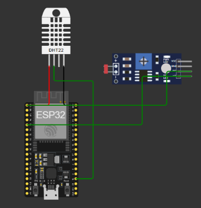

# Documentação do Projeto - Ir Além (FarmTech Solutions)

## 1. Contexto e Justificativa dos Sensores
* **Problema Resolvido:** No escopo do ecossistema FarmTech Solutions, o monitoramento contínuo de variáveis ambientais e microclimáticas é essencial para antecipar cenários e otimizar o rendimento das operações agrícolas.
* **Sensores Utilizados:** 
  * **DHT22:** Escolhido por sua capacidade de mensurar a **temperatura e a umidade do ar**, parâmetros vitais para avaliar o estresse térmico das culturas, prever a evapotranspiração e monitorar o risco de proliferação de pragas fúngicas.
  * **Módulo Fotorresistor (LDR):** Escolhido para o monitoramento da **luminosidade e incidência de luz solar**, permitindo quantificar a exposição diária das plantas à luz natural, o que impacta diretamente na taxa fotossintética e no desenvolvimento da plantação.
* **Justificativa Técnica:** A combinação desses componentes permite coletar parâmetros microclimáticos de forma confiável, barata e compatível com a arquitetura de IoT proposta.

## 2. Arquitetura do Sistema e Tecnologias
* **Microcontrolador:** ESP32 programado em C/C++ com suporte a conectividade Wi-Fi.
* **Simulação e Configuração do Ambiente:** Desenvolvido e validado com o auxílio do ecossistema Wokwi e PlatformIO, atuando em conjunto através de três arquivos-chave:
  * `diagram.json`: Estrutura a montagem visual das portas e as ligações físicas entre o ESP32 e os sensores.
  * `platformio.ini`: Atua na definição do projeto, gerenciando o ambiente de compilação, as placas utilizadas e a importação automática de bibliotecas externas (como a biblioteca do sensor DHT).
  * `wokwi.toml`: Atua nos bastidores configurando os parâmetros de execução e os binários gerados para que a simulação rode perfeitamente no ambiente de desenvolvimento do VS Code.
* **Visualização da Arquitetura (Circuito Wokwi):**
  
  

* **Persistência de Dados e Dashboard:** Os dados simulados e monitorados são processados através da interface interativa em Python (`app.py`) utilizando Streamlit e Pandas, com persistência local em formato estruturado (`sensor_data.json`).

## 3. Instruções de Execução para Avaliação
Para testar e reproduzir o ambiente completo do projeto "Ir Além", siga os procedimentos abaixo divididos entre a simulação de hardware e o painel analítico:

* **Passo 1: Execução da Simulação do ESP32 (Firmware)**
  1. Abra a pasta raiz do projeto no **VS Code**.
  2. Certifique-se de ter a extensão do **PlatformIO** instalada.
  3. Verifique o arquivo `platform.ini` para confirmar a configuração da placa e das bibliotecas.
  4. Acesse o arquivo `src/main.cpp` e clique no ícone de compilação (Check) do PlatformIO para validar o código, ou execute a simulação visual do circuito através do arquivo `diagram.json` com o suporte do Wokwi.

* **Passo 2: Execução do Dashboard Interativo (Python & Streamlit)**
  1. Abra um terminal integrado no VS Code posicionado na pasta raiz do projeto (`Ir Além`).
  2. Ative o ambiente virtual Python (`venv`) pré-configurado com o comando:
     ```powershell
     .\venv\Scripts\Activate
     ```
     *(O terminal exibirá o prefixo `(venv)` indicando que o ambiente isolado está ativo).*
  3. Caso seja a primeira execução em uma máquina nova, instale as dependências necessárias executando:
     ```powershell
     pip install -r requirements.txt
     ```
  4. Inicie o painel de monitoramento interativo executando o comando do Streamlit:
     ```powershell
     streamlit run app.py
     ```
  5. O terminal fornecerá um link local (ex: `http://localhost:8501`). Abra-o em seu navegador para interagir com os controles de simulação dos sensores e visualizar os gráficos em tempo real.